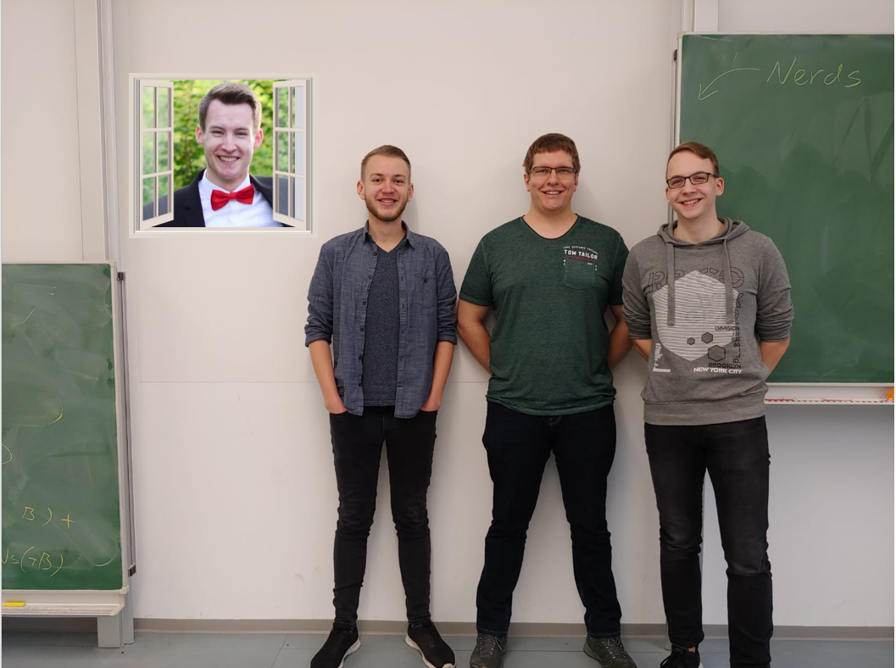
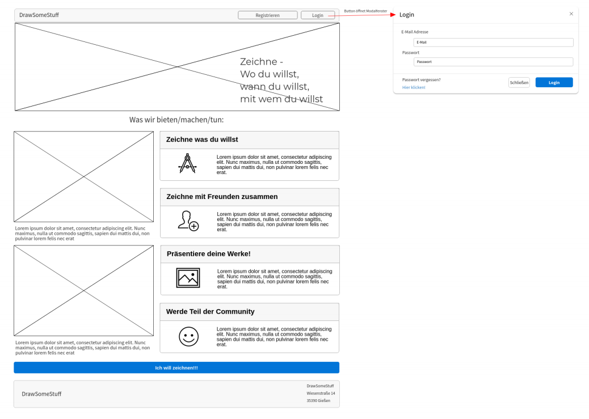
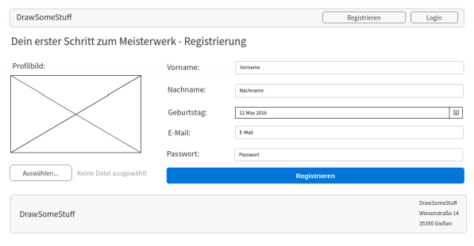
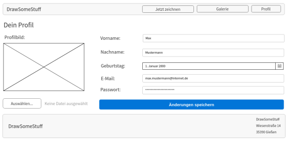
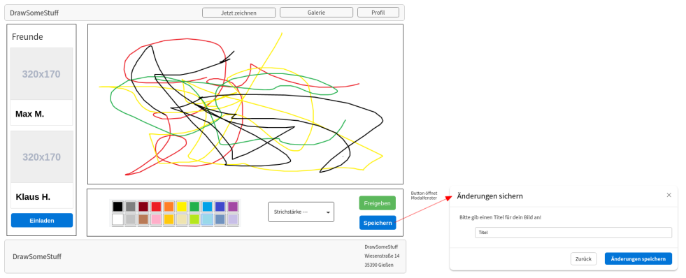
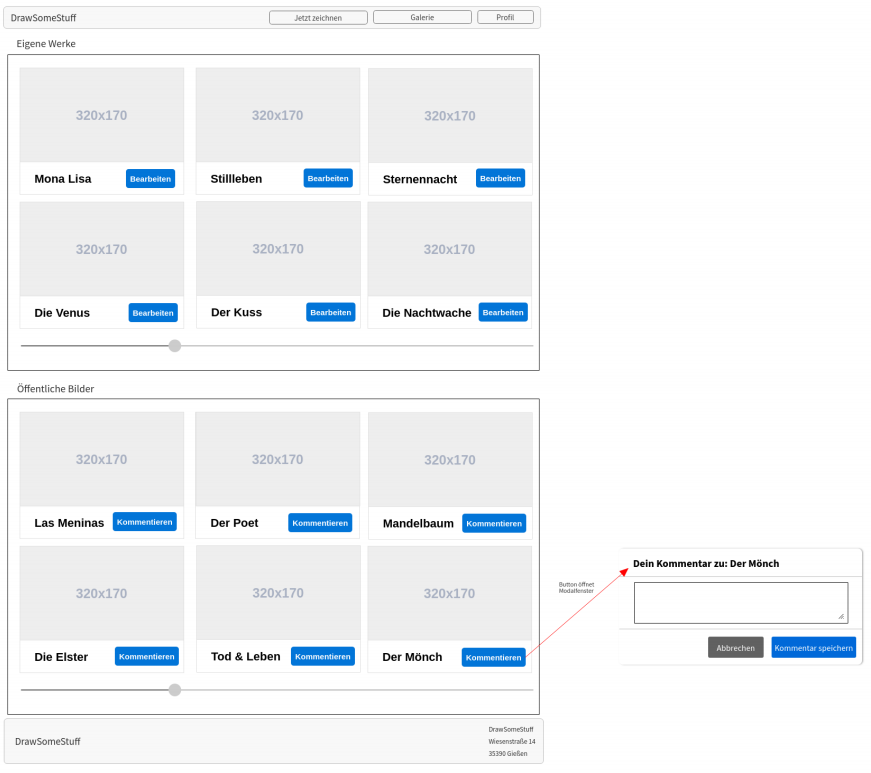
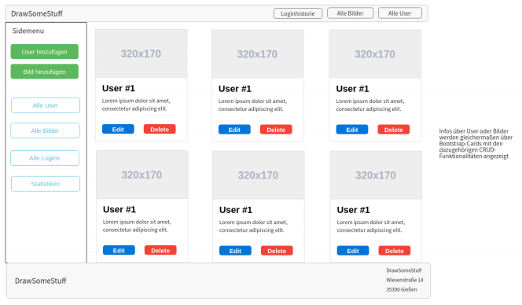
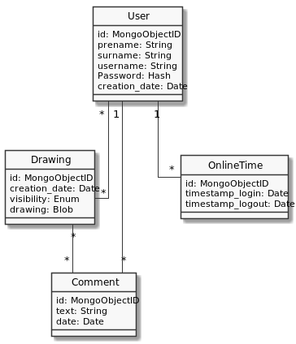
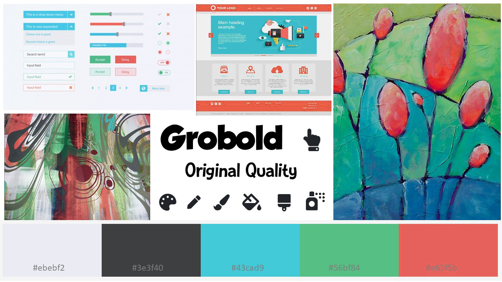

# WBS2 Projektkonzept

Eine deployte Instanz der awendung kann unter [drawio.fmuenscher.de](https://drawio.fmuenscher.de) aufgerufen werden.

## Mitglieder
Dieses Projekt wurde von den folgenden Personen gestützt:
- Jannis Weber
- Felix Tebbe
- Felix Münscher
- Daniel Wölfl

## Aufgabenstellung

### Projektskizze
- Erstellen Sie eine Projektskizze (PDF), in dem Sie eine Webanwendung beschreiben, welche (praktisch) alle Technologien, die Sie in WBS2 gelernt haben umsetzen.
- Die Projektskizze sollte mindestens enthalten:
  - Namen der Gruppenmitglieder (2-4 Personen)
  - Gruppenfoto
  - Allgemeine Beschreibung der Webanwendung
  - Funktionale Anforderungen (Was kann Ihr System im Detail.)
  - Die wichtigsten User Stories
- Die Projektskizze könnte enthalten:
  - Wireframe
  - Erster Entwurf eines Datenbankschema (ERD)
  - Moodboard
  - …

### Technologiestack
Implementieren Sie (mit TypeScript) eine Webanwendung, (≠UserMan), wobei Sie folgende Techniken verwenden:
- Client:
  - Angular
      - bestehend aus **mindestens**: Drei Komponenten, einem Modalfenster, „ein paar“ Dashboard-Elemente, Kommunikation zwischen Komponenten (Input und Output), alle Arten des Bindings, einem Service, einer Pipe, Routing.
  - Bootstrap (mit abgeänderter SCSS-Beschreibung)
  - Kommunikation mit AJAX/Angular-HTTP-Client und ioSocket
- Server
  - NodeJS / Express
  - Synchronisation einiger Callbacks mit Promises/async-await
  - Authentifizierung mit oAuth2 über ein beliebiges "Soziales Netz"
  - Persistierung der Daten mit mongoDB
  - Kommunikation mit Express und ioSocket

### Organisatorisches
- In der Projektwoche benutzen Sie git und dokumentieren Sie Ihre Ergebnisse mit Markdown in der <rawtext>Readme.md</rawtext> (das hatten wir zwar nicht besprochen, aber die ganze Welt macht‘s und Sie bekommen das auch hin).
  - Abgaben im Moodle-Kurs:
  - Projektskizze bis 20.12.2019
  - Projekt (Repo-Link) bis 10.01.2020
- Testat am 10.01.2020
  - Raum und genaue Zeit wird noch bekannt gegeben.
- Präsentation am 13.01.2020
  - Raum und genaue Zeit wird noch bekannt gegeben.

## Umsetzung - Projektskizze

### Gruppenmitglieder
- Jannis Weber
- Felix Tebbe
- Felix Münscher
- Daniel Wölfl

### Gruppenfoto

### Allgemeine Beschreibung der Webanwendung
Die Webanwendung erlaubt es, alleine oder mit mehreren Benutzern gemeinsam Bilder auf einem HTML5-Canvas mittels gegebener Zeichen-Tools zu zeichnen und diese in einer Datenbank zu persistieren.
In einem Newsfeed sind alle öffentlichen Bilder für die Benutzer einsehbar. Diese Bilder können von jedem Benutzer kommentiert werden.
Ein Benutzer kann seine eigenen Zeichnungen anschauen, diese wieder aufgreifen und somit entweder bearbeiten oder als Grundlage für ein neues Bild nehmen.
Als privat markierte Bilder können nur von ihm oder den Administratoren eingesehen werden.
Administratoren haben Zugriffsrechte auf jedes Bild und können diese Löschen. 
Gezeichnete Bilder können auch lokal, per Download, gesichert werden. Ein lokal gesichertes Bild ist von der Anwendung unabhängig und somit nicht einsehbar.
Während des Zeichnens bietet ein Chat die Möglichkeit zur Kommunikation.
Für die Verwendung der Anwendung ist eine Anmeldung erforderlich.

### Funktionale Anforderungen (Was kann unser System)
- Es wird auf eine notwendige Anmeldung hingewiesen, um die Anwendung zu nutzen.
- Ein Bild muss von bis zu fünf Personen performant bemalt werden können.
- Die Anwendung warnt vor Fortschrittsverlust, sollte ein Bild nicht schon gespeichert worden sein.
- Bilder können lediglich bearbeitet (überschrieben) werden, wenn dessen einziger Autor der Benutzer selbst ist.
- Der Chat stellt den eigenen Benutzer den anderen Kommunikationspartnern visuell gegenüber.
- Ein Bild kann bearbeitet werden, sofern der Benutzer auch der einzige Autor ist, oder als Grundlage für ein neues dienen.
- Ein Login mit einem Google-Account ist zusätzlich zum eigenen Login-System möglich.
- Account-Informationen und eigene Bilder können eingesehen werden.
- Benutzer können die Sichtbarkeit der eigenen Bilder verändern.

### User Stories
- Der Benutzer kann sich per Google-Account oder über das anwendungseigene Login-Verwaltungssystem anmelden.
- Ein Benutzer kann seine eigenen Account-Informationen samt Login-Zeiten einsehen und ggf. sein Passwort ändern.
- Ein Administrator hat als einziger Nutzer die Vollmacht über die Anwendung und kann anwendungsspezifische Informationen zu jedem anderen Nutzer (= Bilder) einsehen.
- In der Startseite sieht der Benutzer alle gezeichneten Bilder in einer Art Newsfeed, die als öffentlich eingestellt wurden.
- Kommentare können zu den dargestellten Bildern hinzugefügt werden als Feedback für die Ersteller.
- Über die Gallerieseite kann der Benutzer alle Bilder einsehen, bei denen er mitgewirkt hat.
- Innerhalb der Zeichenseite kann der Benutzer entweder alleine oder mit bis zu vier anderen Benutzern gemeinsam ein Bild zeichnen.
- Ein Bild kann als privat oder öffentlich markiert werden. Damit ist die Sichtbarkeit gemeint. Diese lässt sich nachträglich anpassen.
- Ein fertiges Bild wird in der Datenbank persistiert. Alternativ kann dies lokal heruntergeladen werden. In diesem Fall wird das Bild nicht in dem System hinterlegt.
- In einem Zeichenvorgang kann mehrfach gespeichert werden. Die gespeicherten Bilder werden als voneinander unabhängig betrachtet.
- Während des gemeinsamen Zeichnens kann über Chatnachrichten kommuniziert werden.
- Ein gezeichnetes Bild kann bearbeitet oder als Vorlage für ein neues Bild verwendet werden.

### Wireframe
Die folgenden Ansichten dienen als grobe Übersicht über die Anwendung und als Orientierung während der Entwicklung.

#### LandingPage 

#### Registrierung

#### Profilseite

#### Zeichenseite

#### Galerie

#### Dashboard (Admin)

### Erster Entwurf eines Datenbankschema (ERD)
Entitäten:
- Benutzer
  - id
  - Vorname
  - Nachname
  - Benutzername
  - Passwort
  - Anlegedatum
- Bild
  - id
  - Erstelldatum
  - Benutzer-IDs, die daran mitgewirkt haben
  - Gezeichnetes Bild
  - Verfügbarkeit (öffentlich oder privat)
- Kommentar
  - id
  - Benutzer-ID, der dies verfasst
  - Bild-ID, zu dem der Kommentar gehört
  - Text
  - Verfassungsdatum
- OnlineZeit
  - id
  - Benutzer-ID
  - Login-Datum
  - Logout-Datum
  

### Moodboard (Farbgestaltung)

Die Farbgestaltung setzt sich aus schlichten und unaufgeregten Rot-, Grün- und Blautönen zusammen. Ein farbloser Kontrast wird mit den Tönen Eisweiß und Anthrazit erzeugt.
Die Schriftgestaltung beruht auf leicht verspielten Schriftarten für die Überschriften und Textkörper.

### Problemstellungen
Die hauptsächlichen Problemstellungen der Anwendung belaufen sich auf den Zeichenvorgang mit mehreren Benutzern.
Es gibt unterschiedliche Ansätze, um dies zu realisieren. Dabei verändert sich die Funktionsweise.
Sollen mehrere Benutzer gleichzeitig zeichnen können, muss dies performant geschehen.
Dabei ist zudem wichtig, dass jeder Client ein gleiches Bild vorliegen hat, um Konflikte beim Zeichnen zu vermeiden.

In diesem Projekt wird ein innerhalb des Zeitrahmens umsetzbarer Lösungsansatz gewählt.
Optimalerweise kann jeder Benutzer gleichzeitig zeichnen, wobei jeder andere Benutzer dies "in Echtzeit" mitbekommt.
Alternativ dazu könnte jeder Benutzer aber auch nur einen fertig gezeichneten Strich senden.
Eine weitere Möglichkeit wäre es, nur einen Benutzer gleichzeitig zeichnen zu lassen. In diesem Fall werden Probleme in Bezug auf die Synchronisation vereinfacht.
Eine gewünschte Synchronisierung der Bilder, beispielsweise nach einem Verbindungsverlust, ist dann je nach Vorgehensweise nur bedingt möglich.

### eventuelle Features 
Je nach Auslastung können weitere Features ergänzt werden, nachdem die grundlegende Anwendung funktionstüchtig umgesetzt wurde, um die Anwendung weiter abzurunden.

Dabei handelt es sich um folgende Features:

- Bildgröße (in Pixel) frei wählbar
- Benutzer können gleichzeitig zeichnen (sofern dies nicht schon umgesetzt wurde)
- weitere Login-Möglichkeiten verfügbar (z.B. Facebook, Twitter, etc)
- Synchronisationsmechanismus: Gezeichnete Linien bzw. das bereits gezeichnete Bild kann vom Server abgefragt werden, um trotz eines Verbindungsabbruchs weiter zeichnen zu können.

## Umsetzung - Projekt

Dieses Kapitel umfasst die Reihenfolge von bearbeitetenn Schwerpunkten.

Zu jedem Tag kommen selbstverständlich Bugfixes und gegenseitige Absprache hinzu.

### Tag 1 (06.01.2020)
- Aufbau der grundlegenden Projektstruktur
- Grundgerüst für Client und Server
- Eigener Login und Google-Login
- Erstimplementierung der zu nutzenden Ansichten
- Markup des Layered Canvas Systems
- Styling der Landing Page + Profilseite
- Dashboard

### Tag 2 (07.01.2020)
- Bildergallerie
- Erstmaliges gemeinsames Zeichnen mittels des Layered Canvas Systems
- Sperren benutzerfremder Zeichenlayer
- Lokales Persistieren gezeichneter Bilder
- Dummy-Daten für die Gallerie und Profilseite
- Alerts hinzugefügt

### Tag 3 (08.01.2020)
- Dockerfiles für ein Deployment der Anwendung
- Aufräumen der Verzeichnisstruktur
- Logo hinzugefügt
- Einbinden einer Schriftart
- Layervorschau

### Tag 4 (09.01.2020)
- Überarbeitung des Routings
- Verwendung von Routing Guards
- Tooltip für Zeichenseite
- Profil Registrierung
- Visuelles Feedback bei gesperrten Zeichenlayern
- Einsicht der Login-History für Admins
- Erstellen und Beitreten eines Zeichenraumes
- Lazyload der Galleriebilder
- Sichern gemalter Bilder in der Datenbank
- Offline Zeichnen
- Styling der Zeichenseite

### Tag 5 (10.01.2020)
- Browser Support
- Kleinere finale Anpassungen

Nach der Woche ist eine abgerundete und intuitiv nutzbare Anwendung entstanden, die eine Vielzahl an Möglichkeiten zur Funktionalitätserweiterung bietet.
